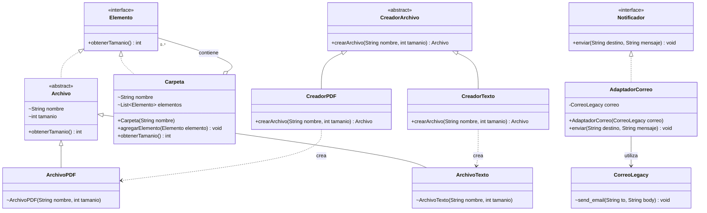

# Análisis de la práctica 3: Refactorización y diseño modular

## 1. Análisis del programa inicial

### ¿Qué hace el método agregarArchivo?

Selecciona si el archivo es PDF o texto, crea el objeto correspondiente y lo agrega a la carpeta indicada.

Este método combina la creación de archivos con su incorporación a una carpeta.

### ¿Qué hace el método obtenerTamanio?

Calcula el tamaño total de una carpeta sumando los tamaños de sus archivos y de sus subcarpetas.

Para las subcarpetas, llama recursivamente al mismo método hasta completar el recorrido.

### ¿Qué hace el método enviarResultado?

Crea un objeto `CorreoLegacy`, obtiene el tamaño total de la carpeta y construye el mensaje con ese resultado.

Después llama a `send_email` para imprimir el destinatario y el mensaje en la terminal.

## 2. Problemas de diseño detectados

| Problema | Dónde aparece | Qué cambio sería difícil | Clase o interfaz responsable |
| --- | --- | --- | --- |
| El cálculo del tamaño depende de listas separadas de archivos y subcarpetas. | En `Carpeta` y `Main.obtenerTamanio`. | Modificar la representación de los elementos obliga a revisar el algoritmo de recorrido ubicado en Main. | `Elemento` define una operación común; `Archivo` devuelve su tamaño y `Carpeta` suma los tamaños de sus elementos. |
| La selección del tipo, la creación y el almacenamiento de archivos están concentrados en un método. | En `Main.agregarArchivo`. | Incorporar otro tipo de archivo requiere modificar las condiciones de creación. | `CreadorArchivo`, `CreadorPDF` y `CreadorTexto` se encargan de construir; `Carpeta` se encarga de almacenar. |
| El envío del resultado depende directamente de la implementación del correo. | En `Main.enviarResultado`, que crea `CorreoLegacy` y utiliza `send_email`. | Sustituir el servicio por uno con una interfaz diferente requiere cambiar el método que envía el resultado. | `Notificador` define la operación de envío y `AdaptadorCorreo` la conecta con el servicio existente. |

## 3. Refactorización y patrones utilizados

### Composite

Se utiliza la interfaz `Elemento` para representar una operación común entre archivos y carpetas: `obtenerTamanio()`.

`Archivo` implementa esa operación devolviendo su atributo `tamanio`. Las clases `ArchivoPDF` y `ArchivoTexto` heredan ese comportamiento.

`Carpeta` también implementa `Elemento` y almacena sus contenidos en una sola lista de tipo `List<Elemento>`. El método `agregarElemento` permite incorporar tanto archivos como subcarpetas.

Para obtener su tamaño, una carpeta suma el resultado de `obtenerTamanio()` de cada elemento. Si el elemento es otra carpeta, esta calcula el tamaño de su propio contenido.

Así, el cálculo puede tratar archivos y carpetas mediante la misma interfaz, sin preguntar por su tipo.

### Factory Method

La clase abstracta `CreadorArchivo` declara el método `crearArchivo(nombre, tamanio)`.

Cada creador concreto determina qué archivo construye:

- `CreadorPDF` devuelve un `ArchivoPDF`.
- `CreadorTexto` devuelve un `ArchivoTexto`.

Main utiliza los creadores y agrega los archivos obtenidos a sus carpetas.

De esta manera se separan dos responsabilidades: el creador construye el archivo y la carpeta lo almacena.

### Adapter

La interfaz `Notificador` define el método `enviar(destino, mensaje)`.

`AdaptadorCorreo` implementa esa interfaz y contiene una referencia a un objeto `CorreoLegacy`. Cuando recibe una llamada a `enviar`, delega en `send_email`, pasando el destinatario y el mensaje.

`CorreoLegacy` conserva su implementación.

El método `enviarResultado` recibe un `Notificador` como parámetro. Por ello, utiliza la operación de la interfaz y no necesita llamar directamente al método del servicio de correo.

## 4. Diagrama de clases

El diagrama muestra las relaciones de Composite, Factory Method y Adapter en la versión final.



### Interpretación del diagrama

- **Implementación:** Archivo y Carpeta implementan Elemento; AdaptadorCorreo implementa Notificador. Se representa mediante una línea discontinua con triángulo.
- **Herencia:** ArchivoPDF y ArchivoTexto heredan de Archivo; CreadorPDF y CreadorTexto heredan de CreadorArchivo. Se representa mediante una línea continua con triángulo.
- **Agrupación:** Carpeta contiene cero o más elementos, que pueden ser archivos u otras carpetas. El rombo vacío está del lado de Carpeta y representa agregación: la carpeta mantiene referencias a esos elementos, sin imponer que le pertenezcan de forma exclusiva.
- **Creación:** cada creador concreto construye el tipo de archivo correspondiente.
- **Uso:** AdaptadorCorreo utiliza CorreoLegacy para realizar el envío simulado.

Los símbolos `+`, `-` y `~` indican acceso público, privado y de paquete, respectivamente.

El diagrama se centra en las clases que participan en los tres patrones. Main actúa como cliente: organiza las carpetas, utiliza los creadores y proporciona el adaptador al método enviarResultado.

## 5. Responsabilidades finales

### ¿Qué responsabilidad se movió a cada clase?

| Clase o interfaz | Responsabilidad |
| --- | --- |
| `Elemento` | Define la operación común para obtener el tamaño de archivos y carpetas. |
| `Archivo` | Devuelve el tamaño de un archivo. |
| `ArchivoPDF` y `ArchivoTexto` | Representan los tipos de archivo y heredan la operación de tamaño. |
| `Carpeta` | Almacena elementos y calcula su tamaño total, incluyendo subcarpetas. |
| `CreadorArchivo` | Declara la operación para crear archivos. |
| `CreadorPDF` | Construye archivos PDF. |
| `CreadorTexto` | Construye archivos de texto. |
| `Notificador` | Define la operación de envío utilizada por el programa. |
| `AdaptadorCorreo` | Conecta la operación `enviar` con `send_email`. |
| `CorreoLegacy` | Imprime el destinatario y el mensaje del correo simulado. |
| `Main` | Organiza el ejemplo, conecta los objetos y ejecuta las pruebas. Su método `enviarResultado` forma el mensaje y utiliza el notificador recibido. |

El cálculo de tamaños queda en los elementos, la construcción de archivos queda en los creadores y la adaptación del servicio de correo queda en el adaptador.

## 6. Verificación de las versiones inicial y final

Se compilaron y ejecutaron por separado la versión inicial de `Paso2` y la versión final de `Paso5`.

En cada carpeta se utilizaron los comandos:

```sh
javac -encoding UTF-8 *.java
java Main
```

Ambas versiones compilaron sin errores.

### Resultados de las pruebas

| Entrada | Esperado | Obtenido en Paso2 | Resultado inicial | Obtenido en Paso5 | Resultado final |
| --- | ---: | ---: | --- | ---: | --- |
| Carpeta sin archivos ni subcarpetas | 0 | 0 | OK | 0 | OK |
| Carpeta con un PDF de 120 | 120 | 120 | OK | 120 | OK |
| Carpeta con un PDF de 120 y un texto de 80 | 200 | 200 | OK | 200 | OK |
| Carpeta con PDF de 120, texto de 80 y una subcarpeta con texto de 50 | 250 | 250 | OK | 250 | OK |
| Carpeta con un archivo de tamaño cero | 0 | 0 | OK | 0 | OK |

Los cinco casos produjeron los resultados esperados tanto en el diseño inicial como en el refactorizado.

### Resultado del ejemplo principal

En ambas versiones se obtuvo:

```text
250
Para: profesor@universidad.edu
Tamanio total: 250
```

La versión final también mostró:

```text
OK: Prueba archivos del ejemplo
```

Las salidas completas y las instrucciones de ejecución se encuentran en [README.md](README.md).

## 7. ¿Qué permaneció igual para quien usa el programa?

El programa conserva el tamaño total de 250 para el ejemplo de la guía.

El destinatario continúa siendo `profesor@universidad.edu` y el mensaje sigue siendo `Tamanio total: 250`.

El correo permanece simulado: se muestra en la terminal y no se envía por internet.

La refactorización modifica la organización interna del código y distribuye sus responsabilidades, manteniendo los resultados del cálculo y del correo.

## 8. Alcance de las pruebas

Las pruebas verifican los cinco escenarios solicitados y permiten comprobar que sus resultados se conservan después de la refactorización.

Que todos los casos indiquen `OK` no demuestra que el programa esté libre de errores en cualquier situación.